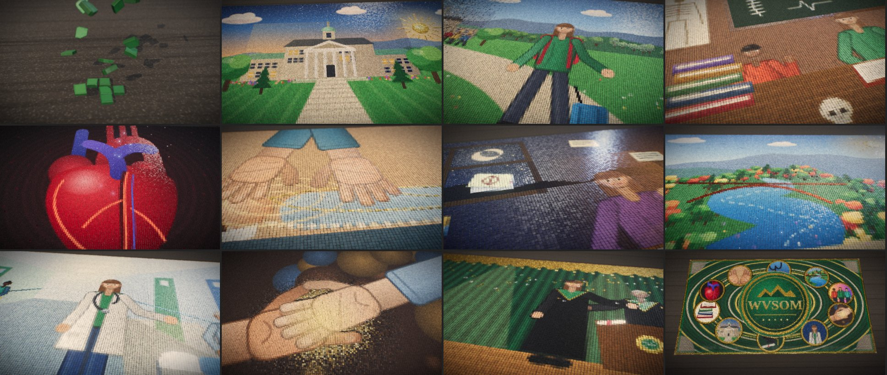

# Your Journey Takes Shape — a WVSOM mosaic film

A real-time, 2 min 22 s cinematic film for the West Virginia School of Osteopathic Medicine. It follows one medical student's journey through a single living mosaic of **36,864 physical tesserae**.



## Running it

The film is a static page with no build step, and three.js is vendored so it also runs offline. Serve the folder over HTTP (ES modules don't load from `file://`):

```bash
npx http-server wvsom-mosaic -p 8123
# open http://localhost:8123
```

Press **Begin**. Controls: `space` pause, `←/→` seek ±5 s, `R` restart, `F` fullscreen, `H` hide the UI.

URL options:

| Option | Effect |
| --- | --- |
| `?t=84` | start at 84 s and autoplay |
| `?autoplay` | skip the title card |
| `?q=low` / `?q=ultra` | lower resolution without depth of field / 2× pixel ratio |
| `?capture` | frame-stepped mode used for video export |

It needs a desktop-class GPU. The page lowers its resolution automatically if frames take too long.

## Exporting a video

`tools/render-frames.mjs` steps the film one frame at a time, so the output is frame-accurate at any render speed:

```bash
npx http-server wvsom-mosaic -p 8123 &
node wvsom-mosaic/tools/render-frames.mjs --out frames --width 1920 --height 1080 --fps 30
ffmpeg -framerate 30 -i frames/%05d.png -c:v libx264 -pix_fmt yuv420p -crf 16 wvsom-mosaic.mp4
```

It needs Playwright (`npm i -D playwright`) and a machine with a GPU. Pass `--from 40 --to 52` to render a slice.

## The official logo

No logo file was supplied, so the final reveal lays a tile wordmark (a gold "WVSOM" under a mountain line). To use the official mark, save it as **`assets/wvsom-logo.png`**, ideally a square PNG with a transparent background. On the final flip it is sampled into tesserae inside the central medallion. The end-card text is HTML (`index.html`, `#endcard`), so fonts and copy are easy to change.

## Structure

| File | Role |
| --- | --- |
| `js/scenes.js` | The artwork. Each chapter is painted into a 256 × 144 cartoon, one pixel per tessera, across three layers: **colour**, **relief** (how far a tile stands proud) and **material**. It also holds the figure, hand, anatomical heart, microscope, stethoscope and landscape painters. |
| `js/timeline.js` | Chapter timings, transition choreography (style, origin, speed, jitter) and the camera path, given as target / distance / elevation / azimuth shots. |
| `js/main.js` | The engine. It re-lays physical tiles whenever the cartoon changes, and handles materials, lighting, the camera, depth of field, bloom and the film grade. |

### How it stays physical

- **Tesserae:** each tile is a real extruded solid with bevelled edges, chipped corners, bowed sides, a slightly domed top and varied thickness. Four hand-cut shapes are instanced with random yaw, tilt and offset, so no two neighbours sit alike.
- **Materials:** glazed ceramic, natural stone (speckled and matte), translucent glass (dark body lit from within, mirror-smooth), gold and metal smalti, vitreous enamel and unglazed ceramic. A custom shader adds batch-to-batch colour variation, glaze thinning at the edges, darker unglazed sides and a hammered surface normal.
- **Grout and light:** the tiles sit in a textured mortar bed. A warm, low raking key light casts soft shadows between the tiles, a cool rim light catches the glass, and studio reflections play across the glossy pieces.
- **Motion:** chapter changes happen only through the tiles themselves:

  | Style | Where it appears |
  | --- | --- |
  | Drop | the opening |
  | Flip-reveal sweeps | arrival, hospital, finale |
  | Scatter and reform | learning, night study |
  | Travelling wave | the heart forming, the hands meeting |
  | Migrate | heart → hands, hands → graduation |
  | Sink and rise | the mountains |

  Heartbeats and moments of touch send shader-driven ripples across the surface. Loose tiles now and then lift, turn in the light and settle again.
- **Camera:** shallow depth of field on close-ups, glides inches above the surface, tilts that show the relief, and a final pull-back that shows the whole artwork as one monumental mosaic.

### Chapters

| Time | Chapter | Palette |
| --- | --- | --- |
| 0:00 | Dark bed → one green tile → hundreds → the campus | green & natural stone |
| 0:17 | Arrival | green & stone |
| 0:28 | Lecture hall: chalkboard anatomy, skeleton, books, microscope, stethoscope, skull & femur, classmates | bright mixed |
| 0:40 | Anatomical heart in red glass; each beat ripples the mosaic | deep red glass |
| 0:52 | Red pieces migrate into osteopathic hands over a patient; gold fascial lines trace the body | warm ceramic & gold |
| 1:03 | Late night study: amber lamp, coffee, growing stacks, flashcards, racing clock | amber |
| 1:15 | West Virginia: mountains rise, autumn forest, glass river, arch bridge, friends hiking | blues, greens, ambers |
| 1:27 | Clinical rotations: corridor, white coat, stethoscope, care team, patient | cool blues |
| 1:38 | A patient's hand meets the student's; gold radiates from the touch | gold |
| 1:44 | Gold travels to form graduation | green & gold |
| 1:56 | Pull back: one enormous mosaic holding every chapter | all |
| 2:06 | The WVSOM identity; end card | green & gold |
